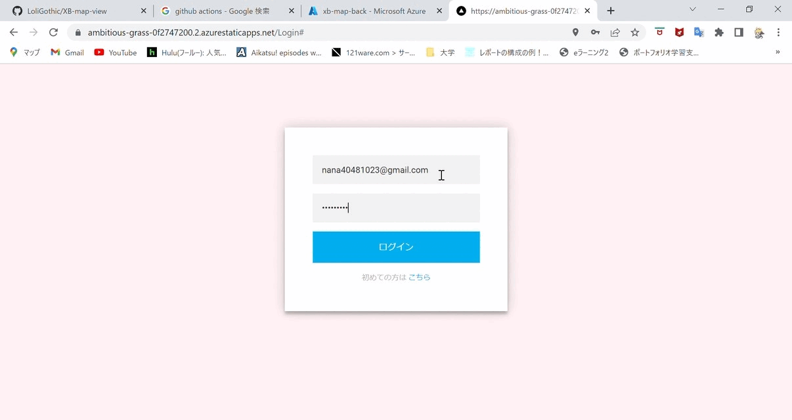
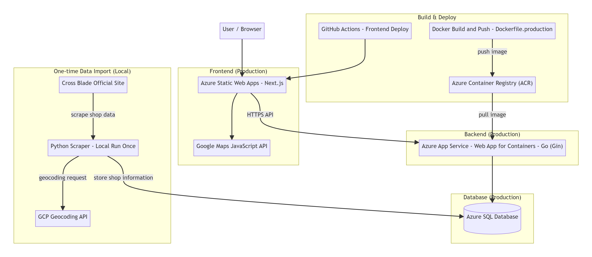
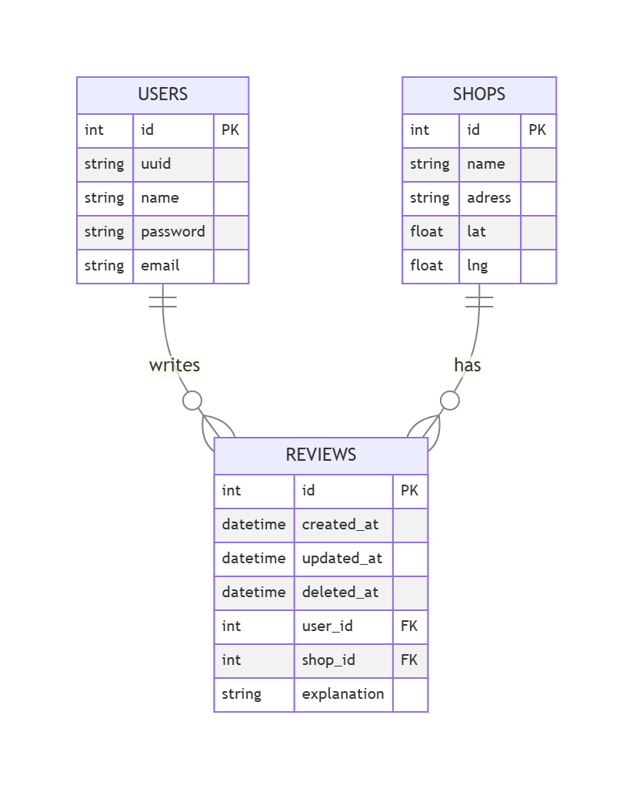

# XB-map - クロスブレイド共有マップ

🌐 Demo  
現在サービス終了のため停止中

⚠️ 本サービスについて

クロスブレイド公式サービスの終了に伴い、本アプリケーションもサービスを終了しました。

現在はポートフォリオ用途としてコードおよび設計資料を公開しています。

🌐 Frontend Repository  
https://github.com/LoliGothic/XB-map-view

⚙ Backend Repository（本リポジトリ）

## 開発背景

私は100円を投入してプレイするカードゲーム「クロスブレイド」を実際にプレイしています。

プレイする中で、

- 椅子が設置されている店舗の方が快適に遊べる
- 一部の店舗ではレアカードが抜かれているという噂がある
- 店舗ごとのプレイ環境の情報が事前に分からない

といった課題を感じました。

公式サイトでは「遊べる店舗の一覧」は確認できますが、
実際のプレイ環境や口コミ情報は共有されていません。

そこで、

**店舗ごとのリアルな情報を、ユーザー同士で共有できる仕組みを作りたい**

と考え、本アプリケーションを開発しました。

## 概要

XB-map は、カードゲーム「クロスブレイド」が遊べる店舗を  
**地図上で可視化し、ユーザー同士で情報共有できるWebアプリケーション**です。

- 遊べる店舗をマップ上にピン表示
- ピンをクリックすると店舗専用掲示板ページへ遷移
- 口コミ・設備情報（椅子の有無など）を投稿可能
- ユーザー同士でリアルタイムに情報共有

店舗情報はスクレイピングにより自動収集し、住所から座標を取得して地図に反映しています。

## デモ

- ログイン
- マップ表示
- ピンをクリック
- 口コミ投稿
- 情報共有
- 口コミ削除
- ユーザ名変更
- パスワード変更

## アプリの流れ

1. クロスブレイド公式サイトから遊べる店舗をスクレイピング
1. 取得した住所を GCP Geocoding API に渡し、緯度経度を取得
1. データベースに保存
1. フロントエンドで地図上にピン表示
1. ユーザーが口コミや設備情報を投稿

## 利用実績

本アプリは実際にクロスブレイドプレイヤー約50名に利用してもらいました。

ユーザーからは、

- 「これはかなり需要のありそうなお話ですね．使わせていただきます．」
- 「とても助かります！みんなで情報共有が出来たら楽しいですね！」
- 「すごいです！活用させていただきます！法律的にどうなのか...はありますが，"抜き"があった店の情報共有はありがたいかも...」

といったポジティブなフィードバックをいただきました。

## 主な特徴

### 🗺️ マップベースUI
遊べる店舗を地図上にピン表示。  
直感的に近くのお店を探すことができます。

### 💬 店舗専用掲示板機能
各店舗に掲示板があり、

- 口コミ投稿
- 椅子の有無
- プレイ環境情報
- 混雑状況

などをユーザー同士で共有可能。

### 🤖 データ自動収集（初期構築時）
- クロスブレイド公式サイトから店舗情報をスクレイピング
- GCP API を利用し座標を自動取得
- 手動入力不要でデータ更新が可能

※ 店舗データは初期構築時にローカルで Python スクレイピングを1回実行して投入します（定期実行はしていません）。

## 本番アーキテクチャ

### 本番構成概要

- **Frontend**: Azure Static Web Apps (Next.js)
- **Backend**: Azure App Service（Web App for Containers）
- **Container Image**: Azure Container Registry
- **Database**: Azure SQL Database
- **Maps API**: Google Maps JavaScript API
- **Geocoding API**: Python スクレイピング時に利用

## データベース設計（ER図）

本アプリケーションでは、以下の3テーブルで構成されています。

- Users（ユーザー情報）
- Shops（店舗情報）
- Reviews（口コミ情報）

### ER図

## 技術スタック

### Frontend
- Next.js (React)
- Google Maps JavaScript API
- GitHub Actions（CI/CD）

### Backend
- Go (Gin)
- gorilla/sessions（セッション管理）
- gorilla/securecookie（Cookie署名）
- Azure App Service（Container）
- Azure Container Registry

### Database
- Azure SQL Database

### Data Processing
- Python
- BeautifulSoup（スクレイピング）
- GCP Geocoding API

## 技術選定理由

### フロントエンド

**Next.js / React / JavaScript**  
これまで最も使用経験があり、開発スピードを重視できるため選択しました。  
コンポーネント設計やルーティング管理が容易で、拡張性も高い点を評価しました。

**Google Maps JavaScript API**  
地図上に店舗を表示する本アプリにおいて必須の機能であり、  
公式ドキュメントや情報が豊富である点から採用しました。

**GitHub Actions**  
push時に自動デプロイを実現するために導入。  
CI/CDの基礎を学ぶ目的もあり、フロントエンドに適用しました。

---

### バックエンド

**Go / Gin**  
これまで Python（Django）でのみバックエンドを構築していたため、  
新しい言語に挑戦する目的で Go を選択しました。  
軽量かつ高速で、シンプルなAPIサーバー構築に適している点も魅力でした。  
責務を明確に分けやすい設計思想も評価しています。

**GORM**  
Go における代表的な ORM であり、  
マイグレーションやモデル管理を簡潔に行えるため採用しました。  
生SQLと組み合わせながら柔軟なクエリ設計が可能な点も利点でした。

**MySQL（開発環境）**  
リレーショナルデータベース設計の理解を深める目的で採用しました。  
外部認証サービスに依存せず、ログイン機能を自作する経験を積むために使用しています。

**Session認証（gorilla/sessions / securecookie）**  
これまで OAuth ベースの認証のみ経験があったため、  
Web アプリケーションの基礎理解を目的にセッションベース認証を自作しました。  

- `gorilla/sessions` によるサーバー側セッション管理  
- `gorilla/securecookie` による Cookie 署名（改ざん検知）  

当初は LocalStorage による認証状態管理を実装していましたが、  
XSS リスクを考慮し、Cookie を利用したセッション方式へ改善しました。  
これにより、より安全な認証設計を実現しています

**crypto（パスワードハッシュ化）**  
ユーザー情報を扱うため、パスワードの平文保存を避け、  
ハッシュ化処理を実装しました。

**Air**  
Next.js のホットリロードが便利だったため、  
バックエンドでも同様の開発体験を実現する目的で導入しました。

---

### データ収集

**Python（スクレイピング）**  
スクレイピング分野で情報が豊富であり、  
実装コストが低いため採用しました。

**GCP Geocoding API**  
住所から緯度経度への変換を自動化するために使用しました。

---

### インフラ

**Docker / docker-compose**  
環境差異をなくし、開発およびデプロイを容易にするため採用しました。

**Azure（学生プラン）**  
学生向け無料枠があり、  
コンテナ運用やクラウド構成を学習する目的で選択しました。

- Azure Container Registry（コンテナ管理）
- Azure App Service（バックエンド稼働）
- Azure Static Web Apps（フロントエンドホスティング）
- Azure SQL Database（本番データベース）

## 工夫したポイント

### 🐳 Docker化によるデプロイ簡略化
バックエンドは Docker イメージ化。  
Azure にイメージをデプロイするだけで本番環境を構築可能。

### 🔄 フロントエンドCI/CD
GitHub Actions により push 時に自動デプロイ。

### 🔐 認証方式の自作（OAuth以外に挑戦）

これまでログイン周りは Firebase 等の **OAuth 方式**しか実装経験がなかったため、  
今回は学習目的も兼ねて **セッションベース認証**の実装に挑戦しました。

- `gorilla/sessions` を用いてサーバ側でセッションを管理
- `gorilla/securecookie` により Cookie の署名（改ざん検知）を実施
- セッションIDを Cookie に保存してログイン状態を維持（LocalStorageは使用しない設計に改善）

これにより、ログイン状態の維持方法やCookie運用、セキュリティ観点（改ざん/XSSリスク）を理解しながら実装できました。

## デプロイ構成

### フロントエンド
GitHub Actions により push 時に自動デプロイ。

### バックエンド
1. Dockerfile.production からイメージ作成
2. Azure Container Registry に push
3. Azure App Service がイメージを pull して起動

Docker化により、  
Azureへイメージをデプロイするだけで本番環境を構築可能。

## 開発環境

- docker-compose によるローカル環境構築
- 開発時は MySQL コンテナを使用
- 本番では Azure SQL Database を利用

## 課題と今後の改善

- バックエンドの CI/CD を未実装
- コードの一部に冗長な実装が残っているため、共通処理の抽出や責務分離を行い、可読性・保守性を向上させたい
- Google Maps（@react-google-maps/api）の更新により UI 崩れが発生しているため、
  Map 描画周辺の依存管理・CSS・状態管理を見直し、保守性を向上させたい
---

